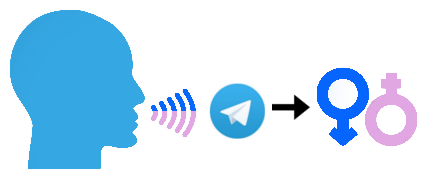

# Speech-Gender-Recognition-Bot

This is a Telegram Bot that recognize the gender from a vocal message, just sent to him the vocal message.

The bot is online and available on Telegram at **[@GenderSpeechBot](https://t.me/GenderSpeechBot)**




This project is based on [this](https://github.com/Valentjno/SpeechGenderRecognition/).

## Requirements

If you want to install locally this bot, it requires:
**Python3.6** (numpy do not officially support python 3.8) and the follow dependencies:

- telegram
- python-telegram-bot
- pydub
- scikit-learn

To install the Python dependencies just use:
```
$ pip3 install -r requirements.txt
```

**R** and the follow dependencies:
- tuneR
- seewave

In a debian-based you can install R and tuneR dependencies with:
```
$ sudo apt install r-base
$ sudo apt install gfortran libsndfile1-dev libfftw3-dev
```

Afterwards you can install the packages with:
```
$ R
$ install.packages("tuneR")
$ install.packages("seewave")
```

## Usage

If you have never created a Telegram Bot, contact **[@Botfather](https://t.me/Botfather)** and make a new one choosing a username and getting the API token.

Afterwards, copy "token.conf.dist" into **"token.conf"** and write your telegram bot token here.

Finally you can run your bot! Use:

```
$ python3 main.py
```

Enjoy!

## Credits

- **[Helias](https://github.com/Helias)**
- **[Valentjno](https://github.com/Valentjno)**
